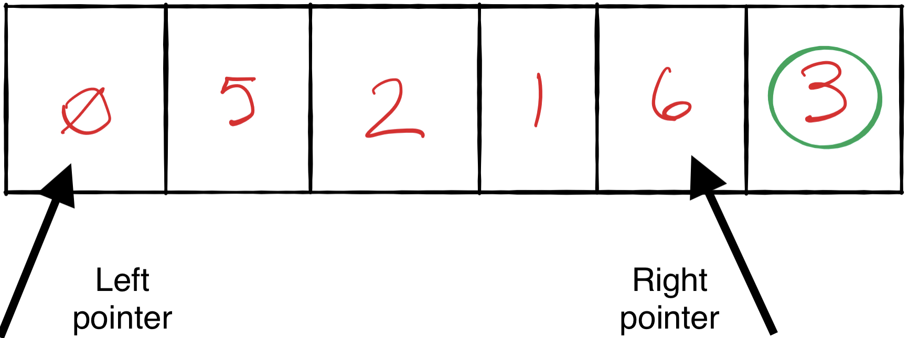
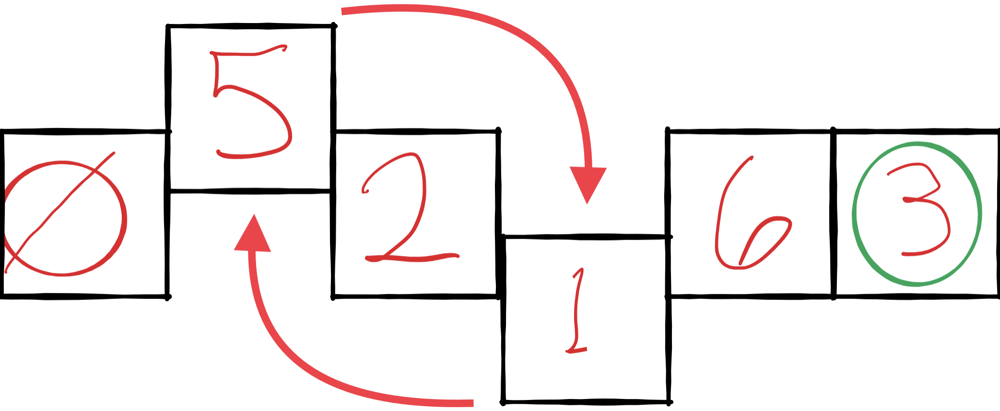
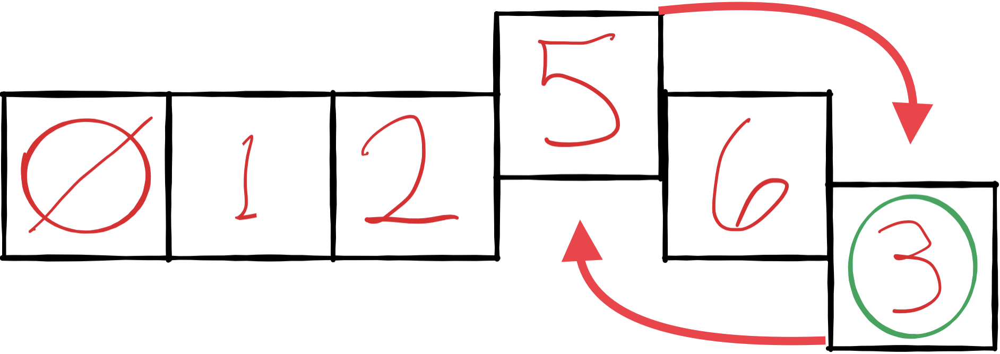
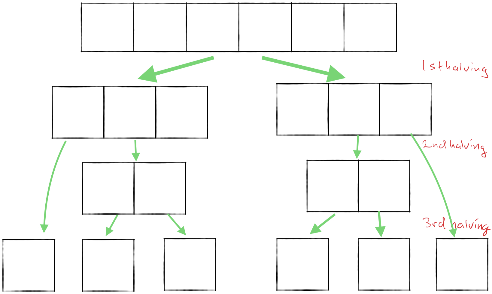

# Quicksort

Quicksort is an extremely fast sorting algorithm that is particularly efficient for average scenarios. While in worst-case scenarios, it performs similarly to Insertion Sort and Selection sort, it is much faster for average scenarios.
Quicksort relies on a concept called _partitioning_

- Partitioning an array is to take a random value from the array, called the _pivot_, and make sure that every number that is less than the pivot ends up to the left of the pivot, and that every number greater than the pivot ends up to the right of the pivot.

Lets say we have the following array:

You can select your pivot point as any of these numbers but lets pick the rightmost number, 3.

Next, we'll assign pointers. One to the left-most value, and one to the rightmost value (excluding the pivot)

Now we're ready to start partitioning:

1. Compare the left pointer (now pointing to zero) to our pivot value of 3.
   - Since 0 is less than the pivot, the left pointer moves on to 5 which is not lower than our pivot value, so the left value stops, and activate the right pointer
1. Compare the right pointer (6) to our pivot value. - Is the value greater than the pivot? You bet it is, so the right pointer moves on to 1 which is less than our pivot value, so our right pointer stops.
   
1. Since both pointers have stopped, we swap the values of the two pointers
   
   
1. The left pointer moves on:
   
   Is the 2 less than our pivot value? Yes, cause science. It moves on.
1. Now both pointers are pointing to the same value:
   
   The left pointer compares 5 to our pivot value and, it being greater, stops.
1. Since the left pointer has reached the right pointer, we're done moving pointers. Now we swap the value that the left pointer is pointing to with the pivot:
   
   

Our array isn't completely sorted yet, but we have successfully completed a partition!!

All of our numbers that are less than 3 are to its left, while all numbers greater than 3 are to its right. This also means the 3 is at its correct place within the array.

The Quicksort algorithm is a combination of partitions and recursion. It works as follows:

1. Partition the array. The pivot is nowin its proper place.
1. Treat the subarrays to the left and right of the pivot as their own arrays and recursively repeat Steps 1 and 2. That means we'll partition each subarray and end up with even smaller sub-arrays to the left and right of each subarray's pivot. We then partition those sub-subarrays and so on.
1. When we have a subarray that has zero or one elements, that is our base case and we do nothing.

In other words, now that our pivot is in the correct place, our logic will tell the rest of the array to do the same thing.

- In the last image above, the 0, 1, and 2 will now partition with pointers the same way we did with the 3.
- Since they're already in order, both pointers will stop.
- Then the 6 and 5 will partition and pivot and the 5 will swap with the 6
  

Congratulations! We've sorted it!

## Efficiency

O(N log(N))

Each time we partitioned the array we broke it down into 2 subarrays.
Assuming the pivot ends up somewhere in the middle of the array, these two subarrays are of roughly equal size.

- [Coded Solution](quick-sort.js)
- [JavaScript Table of Contents](../README.md)
