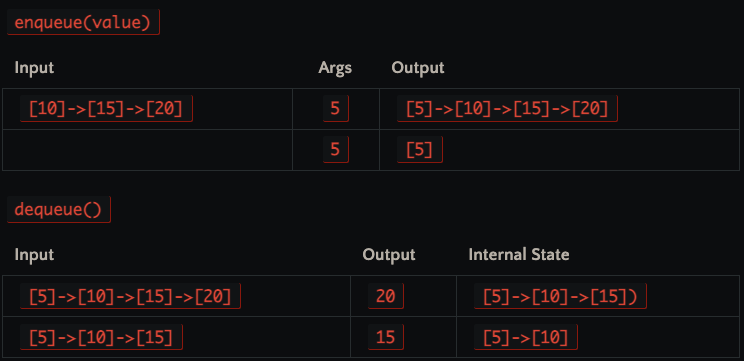

- [Click here](queue_with_stacks.py) for code implementation.
- [Click here](../tests/test_queue_with_stacks.py) for unit tests.
- [Back to Table of Contents](../README.md)

# Challenge Summary
- Implement a Queue using two Stacks

## Challenge Description
- Create a brand new PseudoQueue class. 
- Do not use an existing Queue. 
- Instead, this PseudoQueue class will implement our standard queue interface (the two methods listed below), but will internally only utilize 2 Stack objects. Ensure that you create your class with the following methods:
  - enqueue(value) which inserts value into the PseudoQueue, using a first-in, first-out approach.
  - dequeue() which extracts a value from the PseudoQueue, using a first-in, first-out approach.
- The Stack instances have only push, pop, and peek methods. 
- You should use your own Stack implementation. 
  - Instantiate these Stack objects in your PseudoQueue constructor.

### Example

## Approach & Efficiency
<!-- What approach did you take? Why? What is the Big O space/time for this approach? -->

## Solution
<!-- Embedded whiteboard image -->
